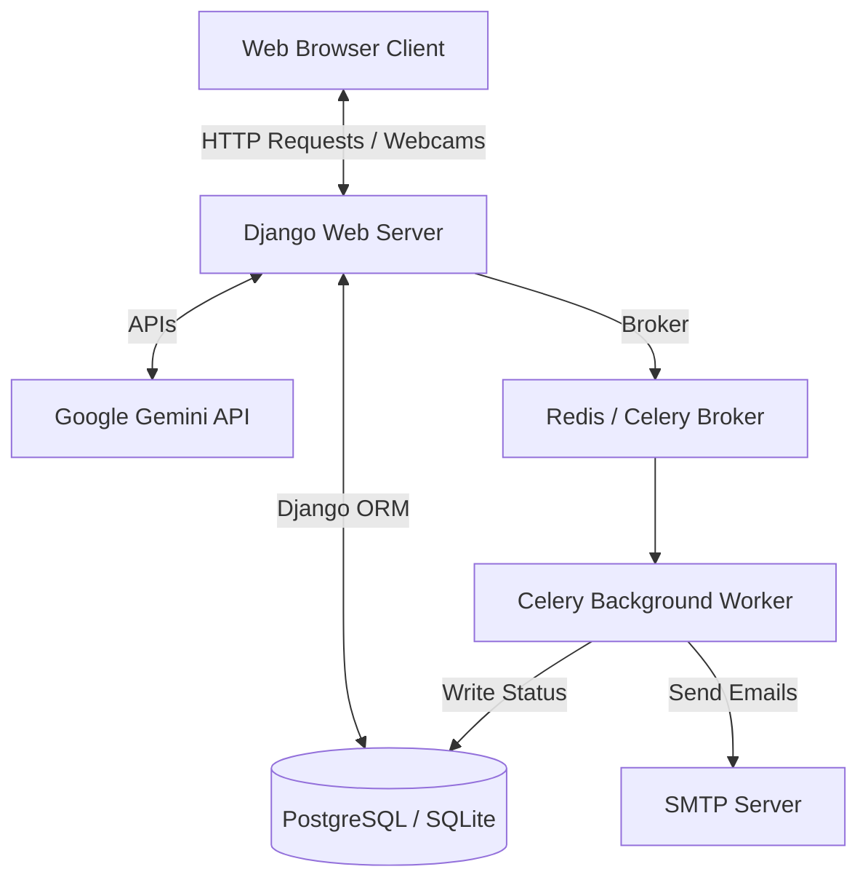
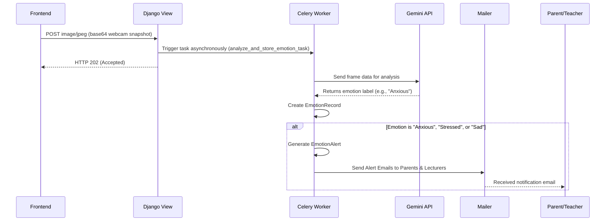

# SkillBuddy Project Architecture Documentation

This document provides a comprehensive technical overview of the architecture, subsystems, data models, and workflows of **SkillBuddy**—an AI-enabled Learning Management System (LMS) with emotion monitoring and virtual tutoring integrations.

---

## 1. High-Level Architectural Design

SkillBuddy is designed using a **Django MVT (Model-View-Template)** pattern, supplemented by asynchronous task workers and external API integrations for AI components. 



### Components
1. **Web Frontend**: Serves responsive views. Includes JavaScript logic for capturing user facial expressions via the browser webcam and visualizing statistics using Chart.js.
2. **Django Application Server**: Implements routing, permission verification, database interactions (via ORM), and session management.
3. **Database (PostgreSQL / SQLite)**: Stores user details, courses, enrollments, student marks, and welfare/emotional state logs.
4. **Celery Worker & Message Broker**: Handles offloaded, computationally heavy, or latency-sensitive tasks like emotion frame classification or emailing alerts asynchronously.
5. **Google Gemini API**: External LLM integration for AI tutor interactions and automated learning roadmap generation.

---

## 2. Django Apps & Directory Structure

The project code is modularized into distinct Django apps:

```
SkillBuddy/
├── accounts/          # User authentication, roles, & profile management
├── ai_tutor/         # AI tutoring service integrations & roadmaps
├── chatbot/          # Session-based student-AI tutor chat portal
├── core/             # Base settings, school sessions/semesters, audits
├── course/           # Programs, courses, schedules, & files
├── emotions/         # Welfare sentiment tracking (webcam capture + notifications)
├── result/           # Course enrollments, grading, GPAs, & attendances
├── config/           # General settings, project routing, Celery config
├── templates/        # Global HTML template files
└── static/           # Global CSS, JS, and image assets
```

---

## 3. Detailed Subsystem Analysis

### A. User Management (`accounts` App)
Governs all identities, roles, and profiles. Implements role-based access control (RBAC).

* **Models**:
  * **`User`**: A unified user model with flags (`is_student`, `is_lecturer`, `is_parent`, `is_dep_head`).
  * **`Student`**: Holds a one-to-one relationship with `User`, adding attributes for `program` (department) and `level` (Bachelor Degree vs. Master Degree).
  * **`Parent`**: Associated with a specific student profile. Enables parents to view academic records and emotion/welfare trends.
  * **`DepartmentHead`**: Linked to specific Programs to manage course allocations and curriculum offerings.
* **Important Code Files**:
  * [accounts/models.py](file:///Users/shanichauhan/Developer/SkillBuddy/accounts/models.py)
  * [accounts/forms.py](file:///Users/shanichauhan/Developer/SkillBuddy/accounts/forms.py)

### B. Curriculum Management (`course` App)
Handles programs, specific courses, schedules, and materials.

* **Models**:
  * **`Program`**: Represents departments/fields of study (e.g., Computer Science, Business).
  * **`Course`**: Identifies specific modules with credit hours, academic year, level, and semester designations.
  * **`CourseAllocation`**: Assigns specific lecturers to teach designated courses during a session.
  * **`ClassSchedule`**: Handles schedule parameters (weekday, start/end times, and classrooms).
  * **`Upload` & `UploadVideo`**: Attaches documents and video resources to specific courses.
* **Important Code Files**:
  * [course/models.py](file:///Users/shanichauhan/Developer/SkillBuddy/course/models.py)
  * [course/views.py](file:///Users/shanichauhan/Developer/SkillBuddy/course/views.py)

### C. Academic Tracking (`result` App)
Bridges students to courses, managing exams, scores, and attendance.

* **Models**:
  * **`TakenCourse`**: The enrollment record representing a course assigned to a student. It calculates marks dynamically across multiple assessments:
    * `total` = `assignment` + `mid_exam` + `quiz` + `attendance` + `final_exam`
    * Grade classification (`A`, `B`, `F`, etc.), GPA credits, and PASS/FAIL marks are computed automatically on `save()`.
  * **`CourseAttendance`**: Tracks student attendance per enrollment, generating warnings if the percentage falls below target thresholds (typically 75%).
* **Important Code Files**:
  * [result/models.py](file:///Users/shanichauhan/Developer/SkillBuddy/result/models.py)
  * [result/views.py](file:///Users/shanichauhan/Developer/SkillBuddy/result/views.py)

### D. Welfare & Emotion Tracking (`emotions` App)
Monitors students' mental/emotional states during academic activities.

* **Models**:
  * **`EmotionRecord`**: Stores sentiment results (Happy, Neutral, Stressed, Sad, Frustrated, Tired, Anxious) with confidence scores and the source input (face, text, or voice).
  * **`EmotionAlert`**: Records triggers indicating negative student conditions (e.g., repeating stress states).
* **Services & Alerts**:
  * Employs webcam frame captures posted to [emotions/views.py](file:///Users/shanichauhan/Developer/SkillBuddy/emotions/views.py).
  * Classifies frames and uses Celery to send automatic alerting emails to parents and allocated teachers when high stress is flagged.
* **Important Code Files**:
  * [emotions/models.py](file:///Users/shanichauhan/Developer/SkillBuddy/emotions/models.py)
  * [emotions/services.py](file:///Users/shanichauhan/Developer/SkillBuddy/emotions/services.py)

### E. AI Copilot (`ai_tutor` & `chatbot` Apps)
Integrates interactive learning helpers.

* **Features**:
  * **Session-based Chat**: Remembers past conversational context in Django session logs and queries the Gemini LLM.
  * **Roadmap Planner**: Generates markdown learning paths and links suggested projects (with title, description, and difficulty) based on student input.
* **Important Code Files**:
  * [ai_tutor/services.py](file:///Users/shanichauhan/Developer/SkillBuddy/ai_tutor/services.py)
  * [chatbot/views.py](file:///Users/shanichauhan/Developer/SkillBuddy/chatbot/views.py)

---

## 4. Key Workflows

### 1. Course Registration Filtering
To prevent students from registering for mismatched subjects, the enrollment portal filters courses dynamically:

```python
courses = Course.objects.filter(
    program__pk=student.program.id,
    level=student.level,
    semester=current_semester,
).exclude(id__in=already_registered_ids)
```

### 2. Async Emotion Frame Processing


---

## 5. Technology Stack Summary

* **Language**: Python 3.x
* **Web Framework**: Django
* **Database**: PostgreSQL (Production) / SQLite (Development)
* **Background Tasks**: Celery with Redis (Broker)
* **AI Provider**: Google Generative Language API (Gemini-2.0-flash)
* **Containerization**: Docker & Docker Compose (`compose.yaml`)
