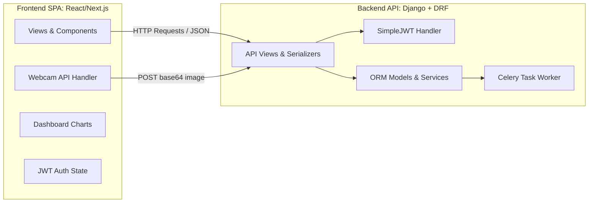

# Decoupled (Separate Frontend & Backend) Architecture in SkillBuddy

This document describes how the separation between frontend and backend is structured in the **current monolithic setup**, and provides a blueprint/architecture guide on how to transition the project into a **fully decoupled architecture** (e.g., React/Vue Frontend + Django REST API Backend).

---

## Part 1: Frontend/Backend Separation in the Current Monolith

Although SkillBuddy currently runs as a single unified Django project, it strictly maintains a **separation of concerns** between client-side assets (Frontend) and server-side logic (Backend):

```
+---------------------------------------------------------------------------------+
|                                 CLIENT-SIDE (Frontend)                          |
|  - HTML Templates: templates/ & app-specific templates/                         |
|  - Styling: static/css/ stylesheets (Vanilla CSS & Bootstrap 5)                |
|  - Dynamic JS: Client webcam streaming, base64 capture, & Chart.js rendering   |
+---------------------------------------------------------------------------------+
                                         ^
                                         |  HTTP requests / JSON / Form posts
                                         v
+---------------------------------------------------------------------------------+
|                                 SERVER-SIDE (Backend)                           |
|  - DB & ORM Models: accounts, course, result, emotions, core models             |
|  - View Controllers: process requests, handle session authentication            |
|  - Service Layer: Gemini API wrappers, Celery tasks, PDF builders, email API    |
+---------------------------------------------------------------------------------+
```

### 1. Client-Side (Frontend) Concern
* **Webcam & Media Capture**: The frontend webcam client (in [emotions/views.py](file:///Users/shanichauhan/Developer/SkillBuddy/emotions/views.py) templates) accesses the browser's MediaDevices API to capture user images, converts them to base64, and POSTs them as JSON.
* **Dashboards & Charts**: Chart rendering logic (using Chart.js in dashboard templates) processes raw JSON arrays served by the backend context to draw enrollment and score charts.
* **Localization/Translation**: Done on the template layer using Django's translation tags (``).

### 2. Server-Side (Backend) Concern
* **Data Processing**: Serves static templates initialized with database context variables.
* **Services**: Encapsulates external services (such as [GeminiClient](file:///Users/shanichauhan/Developer/SkillBuddy/ai_tutor/services.py#L28) inside the `ai_tutor` app) so that API credentials and payload formatting are hidden from the frontend client.

---

## Part 2: Blueprint for a Fully Decoupled Architecture

If you want to split SkillBuddy into two **entirely independent** repositories—a **Frontend SPA (e.g., React, Next.js, Vite)** and a **Headless Backend (Django REST API)**—the architecture will transition to the following layout:



### 1. Backend Changes (Django REST Framework)
To make the backend headless, you will introduce **Django REST Framework (DRF)** and **CORS Headers**:

#### Added Dependencies (`requirements/base.txt`):
```text
djangorestframework
django-cors-headers
djangorestframework-simplejwt  # For JWT-based Token Authentication
```

#### Settings Configuration (`config/settings/base.py`):
```python
INSTALLED_APPS = [
    ...
    'rest_framework',
    'corsheaders',
]

MIDDLEWARE = [
    'corsheaders.middleware.CorsMiddleware',  # Must be placed high up
    ...
]

CORS_ALLOWED_ORIGINS = [
    "http://localhost:3000",  # Frontend local dev server port
]

REST_FRAMEWORK = {
    'DEFAULT_AUTHENTICATION_CLASSES': (
        'rest_framework_simplejwt.authentication.JWTAuthentication',
    ),
    'DEFAULT_PERMISSION_CLASSES': (
        'rest_framework.permissions.IsAuthenticated',
    ),
}
```

#### Serializer Examples:
Instead of rendering HTML, models are converted to JSON using DRF Serializers:
```python
# course/serializers.py
from rest_framework import serializers
from .models import Course

class CourseSerializer(serializers.ModelSerializer):
    class Meta:
        model = Course
        fields = ['id', 'title', 'code', 'credit', 'semester', 'level', 'program']
```

---

### 2. Frontend Changes (React / Vite App)
The client application runs entirely in the browser and connects to the backend over API endpoints.

#### Project Directory Layout:
```
skillbuddy-frontend/
├── public/
├── src/
│   ├── components/      # Reusable UI parts (Navbar, Sidebar, Card)
│   ├── pages/           # Pages (Dashboard, Courses, Chatbot, Login)
│   ├── services/        # API call wrappers (axios modules)
│   ├── store/           # Global State (Auth tokens, User details)
│   └── App.js
└── package.json
```

#### Core API Interface Table:
| Endpoint | Method | Description | Auth Required |
| :--- | :--- | :--- | :--- |
| `/api/token/` | `POST` | User login (returns access & refresh JWT tokens) | No |
| `/api/token/refresh/` | `POST` | Refresh expired access tokens | No |
| `/api/courses/` | `GET` | Retrieve list of eligible courses for registration | Yes |
| `/api/courses/register/` | `POST` | Submit selected courses to enroll (creates `TakenCourse`) | Yes |
| `/api/emotions/capture/` | `POST` | Send webcam base64 frame for analysis | Yes |
| `/api/ai-tutor/roadmap/` | `POST` | Input topic and generate learning roadmap | Yes |

---

### 3. Asynchronous Data Flow in Decoupled Mode

In a decoupled setup, the webcam frame process runs as follows:
1. **Frontend** captures a frame and POSTs it to the backend endpoint `/api/emotions/capture/` with a JWT header: `Authorization: Bearer <token>`.
2. **Backend (DRF View)** validates the token, extracts the student from `request.user`, and queues the analysis:
   ```python
   # emotions/api_views.py
   @api_view(['POST'])
   def capture_emotion_api(request):
       student = request.user.student
       image_data = request.data.get('image')
       task = analyze_and_store_emotion_task.delay(student.id, image_data)
       return Response({"status": "queued", "task_id": task.id}, status=202)
   ```
3. **Celery Worker** runs the analysis, writes `EmotionRecord` into the DB, and dispatches email alerts if required.
4. **Frontend** can optionally poll a task status endpoint to display the emotion results in real-time.
